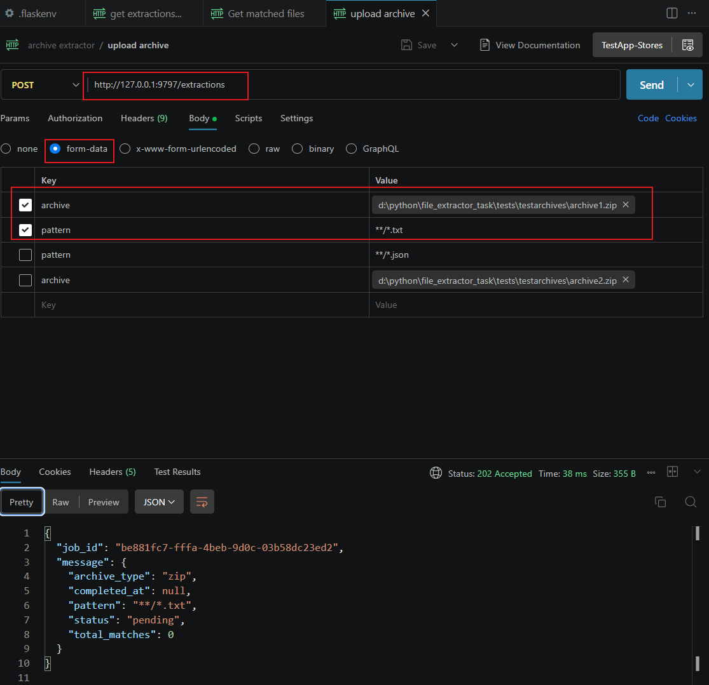
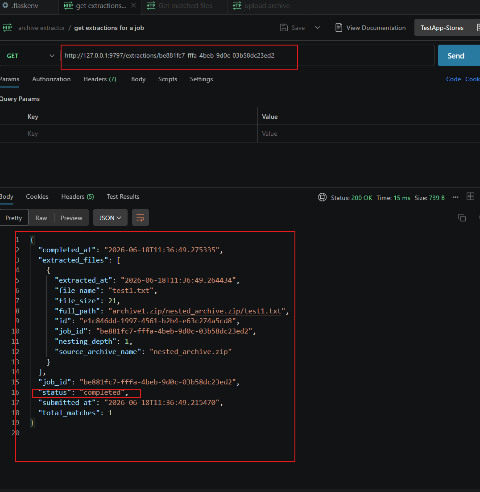
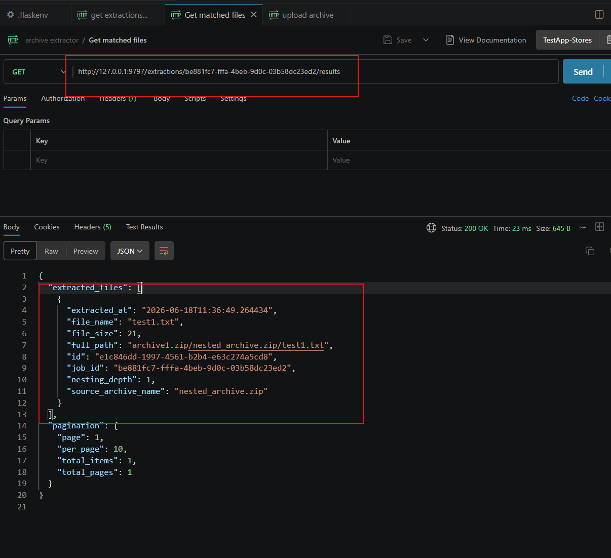

# Setup and build for the app:

## make the env setup

create a file named .flaskenv and configure the environment variables

* FLASK_APP = app
* FLASK_DEBUG =1
* DB_USER = file_extractor
* DB_PASSWORD = password
* DB_HOST = db
* DB_NAME = file_extractor_db
* POSTGRES_USER = file_extractor
* POSTGRES_PASSWORD = password
* POSTGRES_DB = file_extractor_db
* POSTGRES_HOST = db
* DATABASE_URL = postgresql://file_extractor:password@db/file_extractor_db
* WEB_CONCURRENCY = 2
* SCAN_WORKERS = 4
* GUNICORN_TIMEOUT = 120

## to build 

run - docker-compose up --build

## to shutdown 

run - docker-compose down

## connect to database - 

docker-compose exec db psql -U file_extractor -d file_extractor_db

## connect app to shell -

docker-compose exec web sh

## run testcase
* cd tests
* pytest -s -v .\test_app.py

## Test API using postman

* create a new post request at - "http://127.0.0.1:9797/extractions"
* fill the form data with file path (key = "archive", value = "filepath")
* send the data and check body for output, you should get the job_id
* 

now the archive has been pushed, now to check the status create a new request

* create a get request at - "http://127.0.0.1:9797/extractions/<job_id>
* check the output in body for status and other data

now to check matched files create a new request at - "http://127.0.0.1:9797/extractions/<job_id>/results"

* create a new request at - "http://127.0.0.1:9797/extractions/<job_id>/results"
* 
